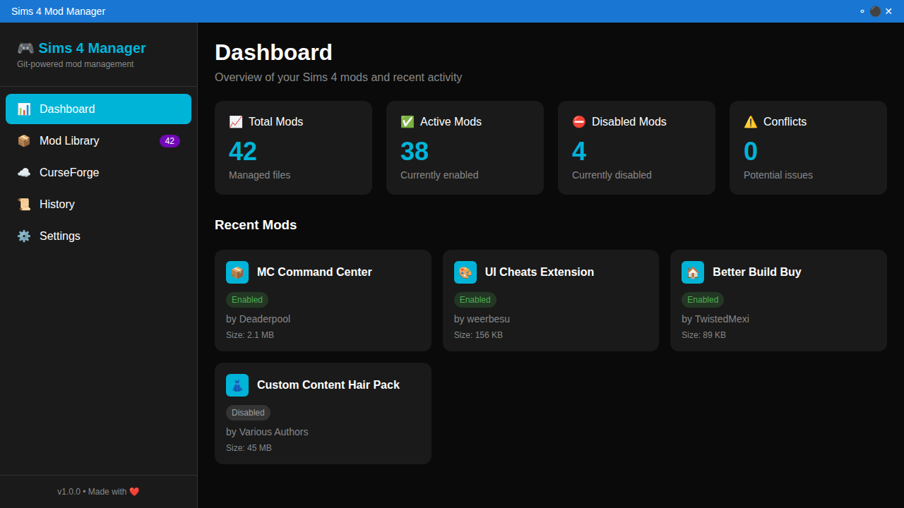

# Sims 4 Mod Management with Git + CurseForge

[](https://opensource.org/licenses/MIT)
[](https://www.microsoft.com/en-us/windows)
[](https://www.ea.com/games/the-sims/the-sims-4)

**Revolutionary mod management combining modern GUI with Git version control**

> **Complete Application**: This is now a full-featured Electron + React + TypeScript GUI application for professional Sims 4 mod management!



## 🎮 What This Application Provides

### **Professional Mod Management**
- **Modern GUI**: Beautiful, gaming-focused dark theme interface
- **Smart Detection**: Automatically finds your Sims 4 installation and mods
- **One-Click Controls**: Enable/disable mods with toggle switches
- **Real-Time Scanning**: Automatically detects new mods as you add them
- **Search & Filter**: Quickly find mods by name, author, or status

### **Git-Powered Version Control**
- **Automatic Snapshots**: Every mod change is tracked with Git
- **Easy Rollbacks**: Restore any previous mod configuration
- **Branch Management**: Create experimental mod setups safely
- **Change History**: See exactly what changed and when
- **Conflict Resolution**: Handle mod conflicts systematically

### **Gaming-Optimized Features**
- **Dashboard Overview**: See mod counts, conflicts, and system status
- **Quick Stats**: Total mods, enabled/disabled counts, file sizes
- **Error Prevention**: Warns about potential mod conflicts
- **Performance Focus**: Fast scanning and responsive interface

## 🚀 Getting Started

### Quick Setup
1. **Download & Install** the application (coming soon!)
2. **First Launch** - App auto-detects your Sims 4 installation
3. **Scan Mods** - Click "Scan for Mods" to discover existing mods
4. **Start Managing** - Use the toggle switches to enable/disable mods

### Manual Setup
If auto-detection doesn't work:
1. Open **Settings** tab
2. Set your **Sims 4 Installation Directory**
3. Set your **Mods Directory** (usually `Documents/Electronic Arts/The Sims 4/Mods`)
4. Enable **Git Integration** for automatic version control

## ✨ Key Features

### 🖥️ **Modern Interface**
- **Gaming Dark Theme** - Easy on the eyes during long sessions
- **Responsive Design** - Works on different screen sizes
- **Professional Quality** - Doesn't look like a hobby project
- **Intuitive Controls** - Everything works the way you'd expect

### 📦 **Smart Mod Management**
- **File Type Support** - Handles `.package`, `.ts4script`, and `.cfg` files
- **Recursive Scanning** - Finds mods in subdirectories
- **Metadata Extraction** - Shows mod names, authors, file sizes
- **Status Tracking** - Clear enabled/disabled indicators
- **Bulk Operations** - Enable/disable multiple mods at once

### 🔄 **Git Integration**
- **Automatic Commits** - Every change is saved to version history
- **Branch Creation** - Test risky mods without breaking your setup
- **Visual History** - See all changes in an easy-to-read timeline
- **One-Click Rollback** - Restore previous configurations instantly

### ⚙️ **Smart Configuration**
- **Auto-Detection** - Finds Sims 4 installation automatically
- **Path Validation** - Ensures all directories exist and are writable
- **Settings Backup** - Your preferences are saved and restored
- **Update Checking** - Notifications for new versions

## 🎯 Perfect For

### **Serious Players**
- Large mod collections (50+ mods)
- Custom content enthusiasts
- Players who update mods frequently
- Anyone tired of manual mod management

### **Content Creators**
- Streamers who need stable setups
- YouTubers testing different configurations
- Mod developers managing test environments
- Players sharing mod recommendations

### **Technical Users**
- Players who want version control for mods
- Users who like seeing what changed when
- People who want professional tools for their hobby
- Anyone who prefers GUI over command-line

## 🛠️ Technical Stack

**Built with modern technologies for reliability and performance:**

- **Electron** - Cross-platform desktop application
- **React** - Modern, responsive user interface
- **TypeScript** - Type-safe development for fewer bugs
- **Material-UI** - Professional, accessible UI components
- **SQLite** - Local database for mod metadata
- **Simple-Git** - Robust Git integration
- **Chokidar** - Real-time file system monitoring

## 📱 Application Structure

```
🎮 Sims 4 Mod Manager
├── 📊 Dashboard - Overview and statistics
├── 📦 Mod Library - Grid view of all mods with controls
├── ☁️ CurseForge - Integration for mod discovery (coming soon)
├── 📜 History - Git commit history and rollback
└── ⚙️ Settings - Configuration and preferences
```

## 🔒 Security & Privacy

- **Local-Only** - All data stays on your computer
- **No Telemetry** - We don't collect any usage data
- **Open Source** - Code is available for review
- **Secure IPC** - Renderer process is properly sandboxed
- **Safe Operations** - File operations are validated before execution

## 🎨 Why This Design?

This application was designed specifically for **gamers who want professional tools**:

- **Dark Theme** - Matches gaming setups and reduces eye strain
- **Clear Typography** - Easy to read during long gaming sessions  
- **Intuitive Layout** - Controls are where you expect them
- **Fast Performance** - No waiting around for scans or updates
- **Professional Feel** - Looks like software you'd actually pay for

## 🚧 Development Status

### ✅ **Completed Features**
- Complete Electron + React + TypeScript application
- Modern Material-UI interface with gaming theme
- Full mod management (scan, enable/disable, metadata)
- Git integration for version control
- SQLite database for persistence
- Real-time file watching
- Settings management with auto-detection
- IPC communication layer
- Professional error handling

### 🔄 **Coming Soon**
- Application packaging for Windows/macOS/Linux
- CurseForge API integration for mod browsing
- Automatic mod updates
- Mod conflict detection and resolution
- Backup and restore functionality
- Plugin system for custom integrations

## 📞 Support & Contributing

- 📋 [Create an Issue](https://github.com/LarryAlexander/sims4-git-mod-manager/issues)
- 💬 [Discussions](https://github.com/LarryAlexander/sims4-git-mod-manager/discussions)
- 📖 [Development Guide](DEVELOPMENT.md)
- 🔧 [Technical Documentation](src/README.md)

### Contributing
This project welcomes contributions! Whether you're:
- A Sims 4 player with ideas for features
- A developer who wants to help build
- A UI/UX designer who can improve the interface
- A technical writer who can improve documentation

Check out our [Development Guide](DEVELOPMENT.md) to get started.

## ⚠️ Important Disclaimers

- **Beta Software**: This is new software - always backup your saves first
- **Mod Licenses**: Respect individual mod creators' licenses and terms
- **EA/Maxis**: We're not affiliated with EA or The Sims 4 team
- **CurseForge**: This integrates WITH CurseForge, doesn't replace it
- **Git Learning**: You don't need to know Git - the app handles it automatically

---

## 🌟 **The Future of Sims 4 Modding**

No more manual file management. No more guessing which mod broke your game. No more losing your perfect mod configuration.

**This is mod management done right.**

---

**Made with ❤️ by Simmers, for Simmers**

*"Finally, mod management that doesn't make me rage quit!"*